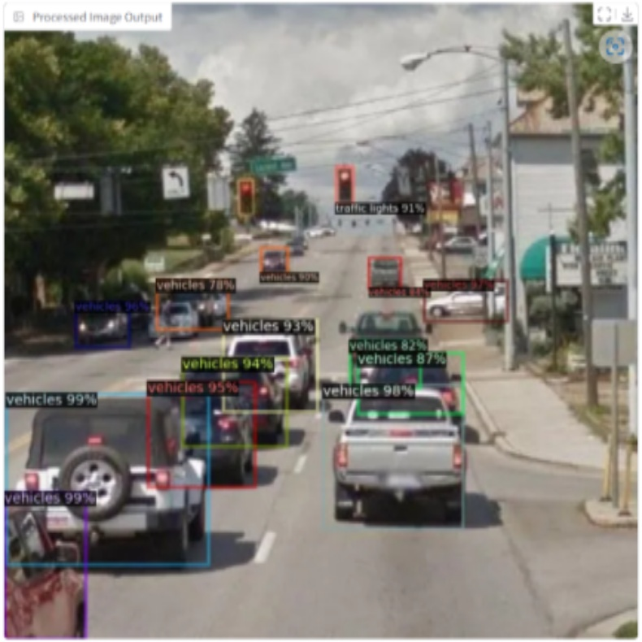

# 🛣️ Real-time Traffic Object Detection Using Detectron 2 with Faster RCNN
This repository contains the implementation of my research titled [_"Real-time Traffic Object Detection Using Detectron 2 with Faster RCNN"_](https://wjarr.com/content/real-time-traffic-object-detection-using-detectron-2-faster-r-cnn), published in World Journal of Advanced Research and Reviews (2024) authored by [Rizama Victor](https://github.com/Rizama-Victor) and [Prince Abiamamela Obi-Obuoha](https://github.com/MelaObuoha) at the National Centre for Artificial Intelligence and Robotics (NCAIR), Nigeria.
## 🔍 Overview
Accurate identification of objects from real-time video is necessary for effective traffic analysis as this plays a vital role in providing drivers and authorities a comprehensive understanding of the road and surrounding environment. Fortunately, modern algorithms such as neural network based architecture with high detection accuracy, like Faster R-CNN are at the center of this process. The project focuses on developing a model capable of identifying key traffic objects such as traffic lights, vehicles, buses, crossroads etc., for urban traffic applications using an interactive Gradio interface and Detectron2’s Faster R-CNN architecture.

## 🎯 Research Objectives

- To develop a computer vision model capable of detecting and identifying multiple key traffic objects such as vehicles, traffic lights, buses, crosswalks, motorcycles etc.
- To design an interactive Gradio-based interface that allows users to perform live detection on video feeds or static images.
- To demonstrate the practical application of neural network–based object detection in urban traffic management systems.
- To evaluate and visualize the detection performance of the model on real-world traffic data.

## 🛠️ Tools and Technologies Used

| Tool / Library              | Purpose in the Project                                                                                |
| --------------------------- | ----------------------------------------------------------------------------------------------------- |
| **Python**                  | Served as the main programming language for implementing the entire detection pipeline.               |
| **PyTorch**                 | Provided the deep learning framework for the Faster R-CNN architecture.                      |
| **TorchVision**             | Supported loading pretrained weights, dataset handling, and image transformation utilities.           |
| **OpenCV**                  | Used for capturing, reading, and processing video and image frames for inference.                     |
| **Detectron2**              | Core framework used to configure, train, and run the Faster R-CNN model for traffic object detection. |
| **Gradio**                  | Enabled creation of an interactive user interface for real-time video and image detection testing.    |
| **Google Colab**            | Provided GPU computational resources and cloud environment for running model training and inference.  |
| **Google Drive**            | Used as storage for saving and loading the trained model weights (`model_final.pth`).                 |
| **NumPy**                   | Supported image array manipulation and data preprocessing.                                            |
| **Matplotlib**              | Used for visualization and performance graph plotting during model training.                          |
| **Model Zoo (Detectron2)**  | Provided the base Faster R-CNN configuration file used for fine-tuning the model.                     |
| **Metadata (Detectron2)**   | Allowed setting and displaying object class names during visualization.                               |
| **Visualizer (Detectron2)** | Handled drawing of detection boxes and class labels on images and frames.                             |

## 🪜 Step-by-step Procedure
1. **Installation and Setup:** This involved the installation of all necessary libraries as already outlined in the **Tools and Technologies** section to ensure that all dependencies required for training and testing the object detection model was available.
2. **Repository Setup:** Involved cloning the official Detectron2 GitHub repository and installing it locally to enable access to its built-in functions and model configurations.
3. **Dataset Allocation:** Three datasets: train, validation, and test sets were allocated using COCO format annotations. Each dataset’s path and JSON file were linked, allowing Detectron2 to load and process them directly.
4. **Data Visualization:** Before training, a few training images and their annotations were visualized using the Visualizer module to confirm the readiness of the dataset for training.
5. **Model Configuration:** The Faster R-CNN architecture with a ResNeXt-101 backbone was loaded from Detectron2’s model zoo. Training hyper-parameters such as learning rate, batch size, training iterations, and number of object classes (12) were also customized to suit the dataset. A collection of the hyperparameters and configuration parameters used is given below:

| Parameter              | Value                                                                                |
| --------------------------- | ----------------------------------------------------------------------------------------------------- |
| **Batch Size**                  | 4               |
| **Warm-up Iterations**                 | 1000                      |
| **Maximum Iterations**             | 1500           |
| **Learning Rate Decay Factor**                  | 0.05                     |
| **ROI Batch Size per Image**              | 64 |
| **Evaluation Period**                  | 500    |
| **Data Loader Workers**                  | 4    |

6. **Custom Training Setup:** A subclass called CocoTrainer was created to enable COCO evaluation during and after training, allowing the model’s performance to be assessed periodically.
7. **Model Training:** The DefaultTrainer was used to train the model using the custom dataset. Training involved oadjusting the model’s weights through multiple iterations to improve its detection accuracy.
8. **Model Evaluation:** After training, the model was evaluated on the test dataset using COCOEvaluator to measure its detection performance and compute metrics like precision, recall, and Average Precision (AP). The model's evaluation metrics is presented below:

| Metric              | Value(%)                   |
| --------------------------- | ------------------ |
| **AP@50-95**                  | 44.2             |
| **AP@50**                 | 76.9                 |
| **AP@75**             | 43.9                     |
| **APs (Small Objects)**                  | 18.2  |
| **APm (Medium Objects)**              | 35.8     |
| **APl (Large Objects)**                  | 53.1  |
| **AR@50-95**                  | 57.9             |

9. **Inferencing and Visualization:** The trained model was used to make predictions on test images. The predicted bounding boxes and class labels were visualized using matplotlib for clear result display. This involved the use of 3 functions namely:
    - _predict_and_display_frame()_ function which received an image frame, performed inference using the trained model, and draws bounding boxes with class labels on detected traffic objects.
    - _live_tracking()_ function read video frames one by one using OpenCV, applied the model predictions, and returned the processed frames simulating real-time object tracking.
    - _detect_objects_in_image()_ function took a still image as input and performed the object detection, returning the labeled image output.
11. **Gradio Inteface Setup:** A Gradio web interface was created using _**gr.Blocks()**_. It provided users with two main options:
    - Upload or stream a video to perform live traffic detection.
    - Upload an image to detect and label objects within it.
12. **Interface Functionality:** Users could click buttons to start detection on their chosen input, and the results (processed video or image) were displayed instantly within the interface.
13. **App Launch:** Finally, the Gradio app was launched using _interface.launch(debug=True)_, and allowing anyone to interact with the trained model in real-time.

  
  
     
    <em> Fig 1: Visualization of the Model's Result on Test Images </em>

## 📚 References
Obi-Obuoha A. , Rizama V.S. _"Real-time traffic object detection using detectron 2 with faster R-CNN"_ World Journal of Advanced Research and Reviews Volume 28 Issue 1 2024 Page 2173–2189.
[Access the Full Paper](https://wjarr.com/sites/default/files/WJARR-2024-3559.pdf)

## 📌 Note
Please kindly note that this README file is a summarized version of the full implementation of this research. The complete implementation can be accessed via the [program script](Real-Time-Traffic-Object-Detection-Using-Detectron-2-With-Faster-RCNN-MAIN.ipynb) and [interface implementation](Real-Time-Traffic-Object-Detection-Using-Detectron-2-With-Faster-RCNN-GRADIO_INTERFACE.ipynb). Dataset and Model Weights can be provided upon request.
